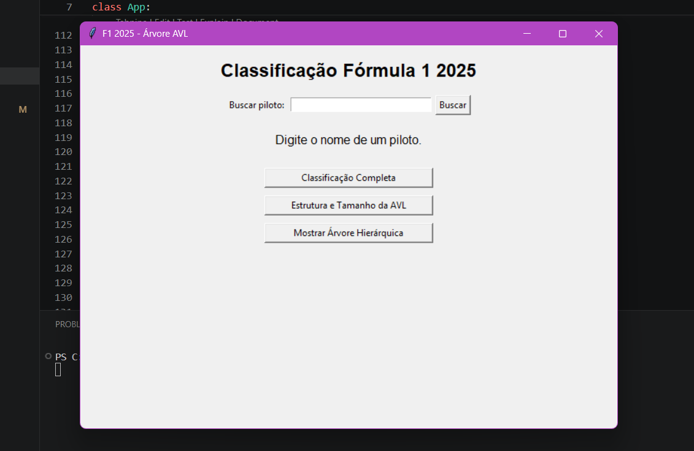

# G14_Arvore_EDA2-2026.1

# G14_Arvore_EDA2-2026.1

## Alunos

| Matrícula | Aluno |
|------------|------------|
| 211030925 | Amanda Gonçalves Sobrinho Abreu |
| 190112093 | Lucas Freire Lopes |

# Sistema de Classificação da Fórmula 1 utilizando Árvore AVL

## Descrição

O projeto consiste em um sistema de gerenciamento da classificação da temporada 2025 da Fórmula 1 utilizando a estrutura de dados Árvore AVL.

Os dados dos pilotos são carregados a partir de um arquivo JSON e armazenados em uma árvore AVL, garantindo que a estrutura permaneça balanceada após cada inserção.

A aplicação possui interface gráfica desenvolvida com Tkinter, permitindo consultar informações dos pilotos, visualizar a classificação completa e analisar a estrutura da árvore.


## Funcionalidades

- Carregamento automático dos pilotos da temporada 2025
- Busca de pilotos pelo nome
- Exibição da equipe do piloto
- Exibição da pontuação do piloto
- Visualização da classificação completa
- Exibição da altura da árvore AVL
- Exibição da quantidade de nós da árvore
- Visualização hierárquica da estrutura da AVL
- Interface gráfica utilizando Tkinter


## Estrutura do Projeto

```text
f1_avl/
│
├── main.py
├── interface.py
├── avl.py
├── piloto.py
│
└── dados/
    └── pilotos_2025.json
```

## Algoritmo Utilizado

### Árvore AVL

A AVL é uma árvore binária de busca balanceada.

Seu principal objetivo é manter a altura da árvore próxima de log₂(n), garantindo operações eficientes de inserção e consulta.

A estrutura utiliza rotações para corrigir desequilíbrios após inserções:

- Rotação Simples à Direita (LL)
- Rotação Simples à Esquerda (RR)
- Rotação Dupla Esquerda-Direita (LR)
- Rotação Dupla Direita-Esquerda (RL)

A ordenação dos nós é realizada utilizando:

```python
(pontos, nome)
```

Dessa forma, pilotos com a mesma pontuação podem coexistir na árvore sem conflitos.


## Funcionamento

### Carregamento dos dados

Ao iniciar o sistema:

1. O arquivo `pilotos_2025.json` é lido.
2. Cada registro é convertido em um objeto `Piloto`.
3. Os pilotos são inseridos na Árvore AVL.
4. A árvore é balanceada automaticamente.

### Busca

O usuário pode pesquisar um piloto pelo nome.

O sistema exibe:

- Nome
- Equipe
- Pontuação

### Classificação

A classificação é obtida percorrendo a árvore em ordem decrescente:

```text
Direita → Raiz → Esquerda
```

Assim os pilotos com maior pontuação aparecem primeiro.


## Complexidade

| Operação | Complexidade |
|-----------|-----------|
| Inserção | O(log n) |
| Balanceamento | O(1) |
| Busca por Nome | O(n) |
| Exibição do Ranking | O(n) |
| Contagem de Nós | O(n) |

### Observação

A busca por nome possui complexidade O(n), pois a árvore é organizada pela chave:

```python
(pontos, nome)
```

e não pelo nome do piloto.

---

## Tecnologias Utilizadas

- Python 3
- Tkinter
- JSON


## Pré-Requisitos

- Python 3.10 ou superior


## Como Executar

```bash
python interface.py
```

## Exemplo de Execução




## Vídeo


https://youtu.be/seu-video
